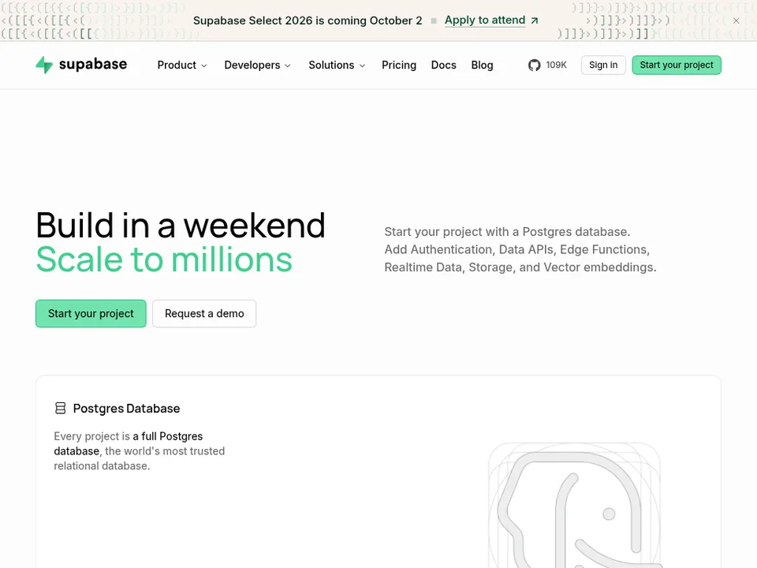
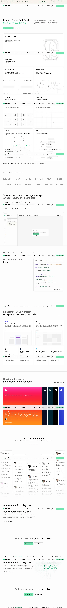

# Supabase Design System





## 1. Visual Theme & Atmosphere

Clean developer-first SaaS aesthetic with a light canvas, restrained neutrals, and emerald as the single primary action accent.
Long-scroll narrative built from alternating text-led sections and product UI showcase cards.
Rounded, bordered modules and generous whitespace create a calm, systematic rhythm despite dense information.

### Key Characteristics
- White/light-gray dominant surfaces with thin 1px borders.
- High hierarchy contrast: bold headline moments, quieter gray body copy.
- Consistent rounded geometry across cards, tabs, inputs, and CTA buttons.
- Minimal iconography (thin strokes, low fill) and UI-mockup-heavy imagery instead of photography.
- Strategic color bursts reserved for showcase modules (customer stories gradients/dark brand panels).

## 2. Color Palette & Roles

Use neutrals for structure/readability, reserve green for primary actions and emphasis, and keep vivid colors isolated to promotional/story modules.

### Core text & structure
| Hex | Role | Where seen |
| --- | --- | --- |
| `#000` | Primary heading and high-contrast text | Hero headline, major section titles, nav wordmark |
| `#525252` | Secondary/body text | Explanatory paragraphs, supporting copy |
| `#575E61` | Muted supporting text | Subtext and lower-emphasis descriptive lines |
| `#E3E3E3` | Hairline border system | Cards, pills, tabs, button outlines, logo band border |

### Primary accent
| Hex | Role | Where seen |
| --- | --- | --- |
| `#3ECF8E` | Primary CTA fill / emphasis highlight | Start your project buttons, highlighted hero phrase |
| `#001A10` | Dark green text on accent contexts | Green-tinted UI text treatments |
| `#00482F` | Deeper green emphasis text | Accent typography and emphasis moments |

### Base surfaces & overlays
| Hex | Role | Where seen |
| --- | --- | --- |
| `#FFF` | Primary page/card surface | Main page background and most cards |
| `#0000` | Transparent backgrounds/gradients | Utility layers, transparent controls/overlays |
| `#00000080` | 50% black overlay | Modal/backdrop overlay states |
| `#000000E6` | 90% black overlay | High-emphasis dark overlay states |

### Dark showcase/code surfaces
| Hex | Role | Where seen |
| --- | --- | --- |
| `#020405` | Deep dark background | Dark showcase panels |
| `#060809` | Near-black background variant | Dark feature/story blocks |
| `#1E1E1E` | Terminal/code background | Code/terminal UI treatments |

### Effects & glow
| Hex | Role | Where seen |
| --- | --- | --- |
| `#0000000D` | Subtle drop shadow tint | Low-elevation drop shadows |
| `#0000001A` | Standard shadow tint | Default shadow utilities |
| `#0000001F` | Medium drop shadow tint | Elevated surfaces |
| `#00000026` | Large drop shadow tint | Heavier drop-shadow states |
| `#171717BF` | Strong shadow color | Dark shadow variants |
| `#34D399CC` | Green glow/text shadow | Accent glow effect |
| `#5252524D` | Neutral translucent gradient mid-tone | Gradient overlays and fades |
| `#DBB8BF` | Soft radial gradient tone | Decorative gradient background |

### Interactive outlines
| Hex | Role | Where seen |
| --- | --- | --- |
| `#0070F3` | Selected tab border accent | Spotlight tab selected state |
| `#00D29480` | Focus/outline emerald 50 | Outline utility states |
| `#00D29499` | Focus/outline emerald 60 | Stronger outline utility states |
| `#061517` | Dark border variant | Dark UI borders |
| `#111718` | Dark border variant | Dark cards/panels |
| `#14191B` | Dark border variant | Dark module separators |

### Notes
All listed hex values are taken directly from provided token colors.

## 3. Typography Rules

Sans-serif system anchored by Manrope/Inter feel for product marketing, with monospace styles for code-heavy modules. Weight usage is restrained (mostly 400 in extracted scale), relying on size, placement, and color for hierarchy.

### Hierarchy
| Role | Font | Size | Weight | Line height | Letter spacing |
| --- | --- | --- | --- | --- | --- |
| Body | -apple-system, BlinkMacSystemFont, Helvetica, Arial, system-ui, sans-serif | 16px | 400 | normal | normal |
| Body (inherit contexts) | inherit | inherit | 400 | normal | normal |
| Small | -apple-system, BlinkMacSystemFont, Helvetica, Arial, system-ui, sans-serif | 14px | 400 | normal | normal |
| Small | -apple-system, BlinkMacSystemFont, Helvetica, Arial, system-ui, sans-serif | 12px | 400 | 1.4em | normal |
| Small | -apple-system, BlinkMacSystemFont, Helvetica, Arial, system-ui, sans-serif | 12px | 400 | normal | normal |
| Small | -apple-system, BlinkMacSystemFont, Helvetica, Arial, system-ui, sans-serif | 11px | 400 | 24px | normal |
| Mono | var(--font-source-code-pro), "Source Code Pro", ui-monospace, Menlo, Consolas, "Courier New", monospace | 16px | 400 | normal | normal |
| Mono | var(--font-source-code-pro), "Source Code Pro", ui-monospace, Menlo, Consolas, "Courier New", monospace | 1.2em | 400 | normal | normal |
| Mono | var(--font-source-code-pro), "Source Code Pro", ui-monospace, Menlo, Consolas, "Courier New", monospace | 1rem | 400 | 1.2rem | 0 |
| Mono | var(--font-source-code-pro), "Source Code Pro", ui-monospace, Menlo, Consolas, "Courier New", monospace | .95rem | 400 | normal | normal |
| Mono | var(--font-source-code-pro), "Source Code Pro", ui-monospace, Menlo, Consolas, "Courier New", monospace | 14px | 400 | 19px | 0 |
| Mono (inherit contexts) | var(--font-source-code-pro), "Source Code Pro", ui-monospace, Menlo, Consolas, "Courier New", monospace | inherit | 400 | normal | normal |

### Principles
- Use display family (var(--font-manrope,var(--font-sans))) for major headings; keep body in sans/system stack.
- Keep body and UI copy neutral and readable; rely on spacing and color accents for emphasis.
- Use monospace selectively for code snippets, terminal UI, and technical micro-elements.
- Prefer consistent regular weight from tokens; express hierarchy primarily via role/placement and section scale.

## 4. Component Stylings

### Buttons
- **Primary CTA** — background: #3ECF8E; text: #001A10; border: 1px solid #E3E3E3; radius: var(--radius-md) / .375rem and rounded variants up to 300px or 3.40282e+38px for pill/full; padding: .5rem .75rem; hover: No deterministic hover transition token provided; keep state change minimal (color/border only).
- **Secondary CTA** — background: #FFF; text: #000; border: 1px solid #E3E3E3; radius: var(--radius-md) / .375rem (pill variants observed); padding: .5rem .75rem; hover: No deterministic hover transition token provided; use subtle border/text emphasis.

### Cards
Primary card system uses white surfaces, thin borders, soft radii, and generous internal whitespace. Used for product capability tiles, dashboard/code previews, template cards, testimonials, and community quote modules.
- background: #FFF
- border: 1px solid #E3E3E3
- radius tokens in use: .25rem, .375rem, .5rem, .75rem, 1rem, 1.5rem, 14px, 20px, 24px
- optional elevation: 0 13px 27px -5px rgba(50,50,93,.25),0 8px 16px -8px rgba(0,0,0,.3),0 -6px 16px -6px rgba(0,0,0,.025)

### Inputs
Inputs/selects/textarea default to white fill with subtle neutral borders and ring-based focus composition.
- background-color: #FFF
- outline on focus: 2px solid #0000
- ring offset width: 0px (text-like controls), 2px (checkbox/radio focus path)
- ring shadow composition: var(--tw-ring-offset-shadow),var(--tw-ring-shadow),var(--tw-shadow)
- radius usage includes var(--radius-md,.375rem), .5em, .25rem

### Navigation
Sticky-style top nav on white with logo left, product links center, utility/CTAs right. Horizontal layout with clean border separation and compact controls.
- surface: #FFF
- text: #000 / #525252
- CTA accent: #3ECF8E
- borders/dividers: #E3E3E3
- compact rounded controls: var(--radius-md), var(--radius-lg), rounded-full

### Image Treatment
Imagery is primarily product UI, diagrammatic line art, code panels, and branded showcase blocks. Minimal photography; user avatars appear in social proof modules.
- neutral illustration lines on #FFF backgrounds
- accent dots/glows using #3ECF8E and #34D399CC
- dark showcase backgrounds: #020405, #060809, #1E1E1E
- occasional decorative gradient tone: #DBB8BF

### Distinctive
- **Product capability matrix cards** — Large, bordered, rounded cards mixing concise copy with technical illustrations (database, auth, functions, storage, realtime, vector, APIs).
- **Code/demo browser frames** — Embedded faux app/browser shells with sidebars, tabs, and monospace code; technically oriented visual proof.
- **Customer story strip with dominant gradient card** — One expanded, high-saturation story card paired with narrow dark brand panels to create contrast and momentum.
- **Community masonry testimonials** — Dense wall of quote cards with avatars/handles and clipped edges suggesting continuous social feed.

## 5. Layout Principles

### Spacing Scale
Tokenized spacing includes negative, px, rem, em, and viewport values. Frequently used foundation values include 1px, 2px, 3px, 4px, 5px, 6px, 8px, 10px, 12px, 15px, 16px, 20px, 24px, 28px, 30px, 32px, 34px, 38px, 40px, 42px, 44px, 50px, 56px, 58px, 60px, 66px, 70px, 80px, 100px, 105px, 108px, 116px, 120px, 128px, 140px, 150px, 180px, 200px, 220px, 240px, 250px, 260px, 280px, 290px, 300px, 320px, 350px, 400px, 420px, 440px, 450px, 480px, 500px, 600px, 700px, 900px, plus .1em, .1875em, .2em, .375em, .5em, .571429em, .75em, .8em, 1em, 1.1em, 1.14286em, 1.2em, 1.25em, 1.4em, 1.5em, 1.6em, 1.625em, 2em, 3em, .2rem, .25rem, .4rem, .5rem, .75rem, 1rem, 1.2rem, 3rem, and viewport-linked 10vh, 60vh, 80vh, 100vh, 100svh, 100vw.

### Grid
Primarily centered single-column page flow with internal two-column card grids at desktop widths; repeated max-width container behavior (notably 480px utility container and larger content wrappers in rendered layout).

### Whitespace
Generous vertical section breaks separate narrative chapters (hero → features → trust → product demos → templates → stories → community → open source → final CTA).

### Radius Scale
0, 2px, 4px, 6px, 7px, 8px, 9px, 14px, 16.9281px, 20px, 24px, 300px, 50%, 100%, 3.40282e+38px, .25em, .5em, .125rem (xs), .25rem (sm), .3125rem, .375rem (md), .5rem (lg), .75rem (xl), 1rem (2xl), 1.5rem (3xl), plus token refs var(--radius-xs/sm/md/lg/xl/2xl/3xl), var(--radius-md,.375rem), and directional corner variants.

## 6. Depth & Elevation

### Levels
| Level | Use | Shadow |
| --- | --- | --- |
| Flat | Default page sections and many cards | `none` |
| Low | Subtle control emphasis | `0 1px 1px #0000000d / 0 1px 3px 0 var(--tw-shadow-color,#0000001a),0 1px 2px -1px var(--tw-shadow-color,#0000001a)` |
| Medium | Elevated modules and previews | `0 3px 3px #0000001f / 0 4px 6px -1px var(--tw-shadow-color,#0000001a),0 2px 4px -2px var(--tw-shadow-color,#0000001a)` |
| High | Heroic demo/code panels | `0 13px 27px -5px rgba(50,50,93,.25),0 8px 16px -8px rgba(0,0,0,.3),0 -6px 16px -6px rgba(0,0,0,.025)` |

### Philosophy
Depth is conservative and utility-driven: primarily border-defined surfaces with selective shadows for interactive or showcase modules.

## 7. Interaction & Motion

### Hover States
Primary/secondary buttons, nav links, tabs, and text links present clear affordances; static captures suggest subtle visual shifts rather than dramatic motion.

### Focus States
Focus system uses transparent outline plus ring composition: outline 2px solid #0000; ring offset and ring shadows via --tw-ring-offset-shadow and --tw-ring-shadow; checkbox/radio focus uses calc(2px + var(--tw-ring-offset-width)).

### Transitions
No deterministic transition-duration/easing token was provided in the CSS facts digest; do not invent timing values.

## 8. Responsive Behavior

### Breakpoints
| Name | Min width | Primary changes |
| --- | --- | --- |
| bp-1 | 480px | Container and component widths step up from compact mobile layouts. |
| bp-2 | 40rem | Feature cards and content blocks gain wider horizontal breathing room. |
| bp-3 | 48rem | Two-column section structures become more prominent. |
| bp-4 | 64rem | Desktop layout stabilizes with broad two-column modules and persistent top nav distribution. |
| bp-5 | 80rem | Large-screen spacing expands; showcase modules present with fuller width. |
| bp-6 | 96rem | Very wide viewport scaling for expansive section compositions. |
| bp-9 | 768px | Tablet/desktop crossover behavior for card grids, nav density, and demo panel proportions. |

### Touch Targets
Buttons and pills visually maintain comfortable hit areas with .5rem .75rem padding and rounded shapes.

### Collapsing Strategy
Desktop two-column feature blocks collapse toward single-column stacking on smaller widths; long-form narrative remains linear and scannable.

### Image Behavior
UI mockups and showcase cards scale within bordered containers; collage/testimonial modules crop at edges to imply overflow continuity.

## 9. Agent Prompt Guide

### Quick Color Reference
```text
Primary action: #3ECF8E
Primary text: #000
Secondary text: #525252 / #575E61
Primary surface: #FFF
Primary border: #E3E3E3
Dark showcase: #020405 / #060809 / #1E1E1E
```

### Example Prompts
- Build a Supabase-style hero on #FFF with a two-line headline (black + #3ECF8E emphasis), supporting gray copy, and adjacent primary/secondary CTAs using 1px solid #E3E3E3 borders and rounded md corners.
- Create a 2-column product card grid with white cards, 1px #E3E3E3 borders, rounded radii from .375rem to .75rem, minimal line icons, and sparse green accent points (#3ECF8E).
- Generate a testimonial section with one dominant high-contrast feature card and multiple narrow adjacent brand cards, followed by a centered community CTA block on a light background.

### Iteration Guide
- Start with border-first surfaces and add shadow only to priority demo modules.
- Keep accent discipline: green for action/emphasis, neutrals for everything else.
- Maintain long-scroll rhythm: statement section → proof band → product demo → social proof → final CTA.
- When uncertain on sizing/radius/spacing, reuse exact token values (especially .25rem/.375rem/.5rem/.75rem/1rem and 1px #E3E3E3 borders).
